<!-- <h1 align="center">โมเดลตรวจจับฉลากขวดน้ำ RMUTR</h1>
<h2 align="center">RMUTR-water-bottle-label-detection-using-AI-model</h2> -->
# โมเดลตรวจจับฉลากขวดน้ำ RMUTR
## RMUTR Water Bottle Label Detection Using AI Model


## 1. การเตรียมข้อมูล (Data Preparation)

วัตถุประสงค์ของ Mini Project โมเดลตรวจจับขวดน้ำและฉลาก RMUTR จัดทำขึ้นเพื่อศึกษาการใช้โมเดลคณิตศาสตร์มาประยุกต์กับการตรวจสอบการวางตำแหน่งของฉลากขวดน้ำ RMUTR ว่าอยู่ในตำแหน่งที่ถูกต้องเหมาะสมหรือไม่ ก่อนที่ขวดน้ำจะเข้าเครื่องอบไอน้ำให้ฉลากหดตัวเข้ากับรูปทรงขวดน้ำในกระบวนการถัดไป 

<table align="center">
  <tr>
    <td align="center" width="50%">
      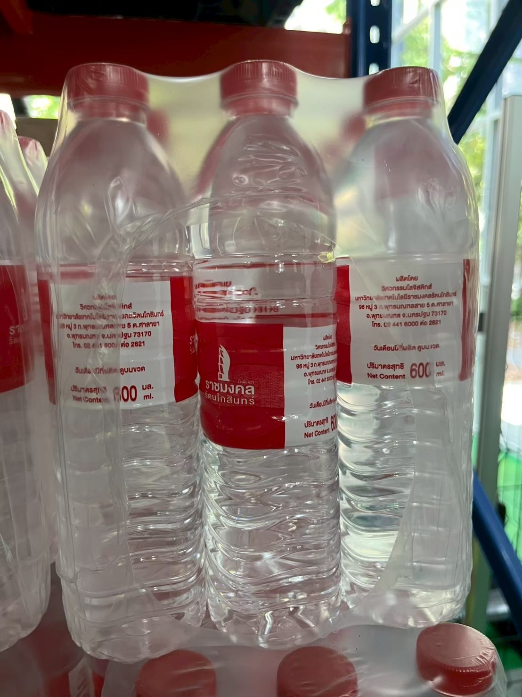
    </td>
    <td align="center" width="50%">
      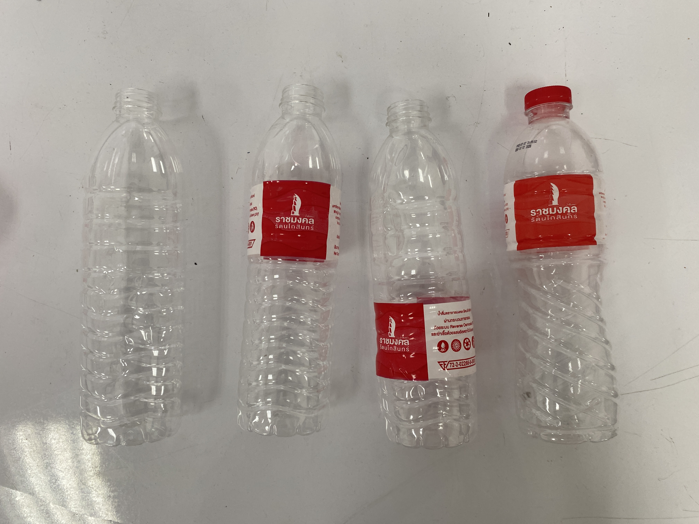
    </td>
  </tr>
</table>

โดยแบ่งประเภทข้อมูลฉลากเป็น 3 กลุ่ม ได้แก่

1. **OK ->** ขวดน้ำที่มีฉลากสมบูรณ์ (ขอบล่างของฉลากไม่ต่ำเกินขอบสีเขียว)

   <p align="center">
     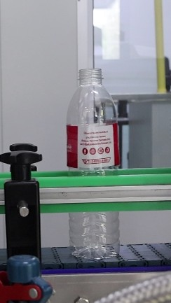
   </p>

2. **NG ->** ขวดน้ำที่มีฉลากไม่สมบูรณ์ (ขอบล่างของฉลากต่ำเกินขอบสีเขียว) และขวดน้ำที่ไม่มีฉลาก

   <p align="center">
     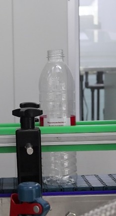
   </p>

3. **Label leak ->** ฉลากขวดน้ำที่หลุด

   <p align="center">
     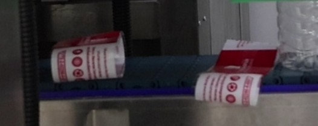
   </p>

โดยตัวอย่างข้อมูลที่เก็บจากโรงงานผลิตเป็นคลิปวีดิโอ ดังนั้นจะต้องทำการสร้างข้อมูลภาพจากวีดิโอ โดยวิธีที่ใช้จะเป็นการเขียนโปรแกรมภาษา Python ให้อ่านวีดิโอแล้วจับภาพนิ่งแบบเต็มเฟรมและแบบ Crop เฉพาะบริเวณขวดน้ำ ทุก ๆ 3 วินาที แล้วบันทึกเก็บไว้ในโฟลเดอร์

<p align="center">
  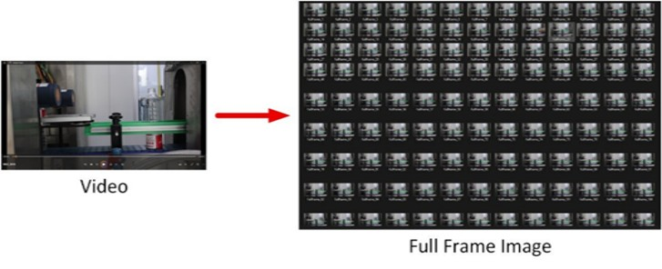
</p>

<p align="center">
  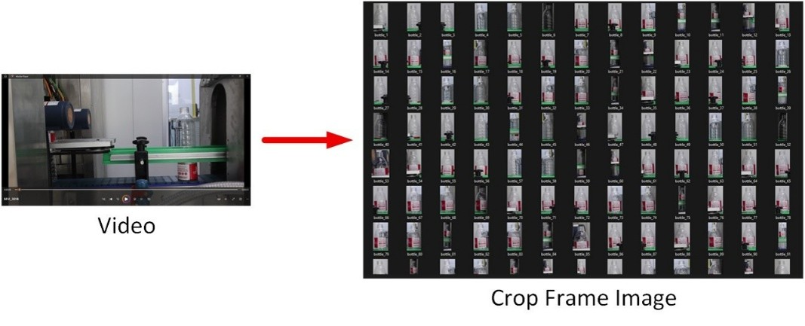
</p>

จากนั้นนำภาพขวดน้ำที่แตกต่างกันทั้งหมด 300 ภาพ อัปโหลดลงบนเว็บไซต์ Roboflow เพื่อทำการ Label ข้อมูลตามกลุ่มที่แบ่งไว้ (3 Classes : OK NG และ Label leak)

<table align="center">
  <tr>
    <td align="center">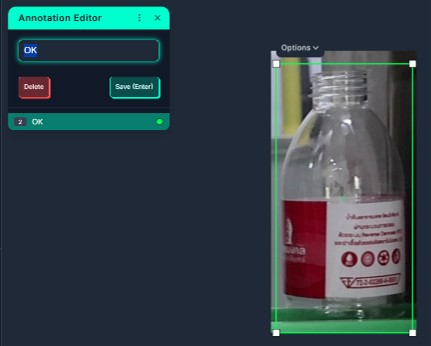<br>OK</td>
    <td align="center">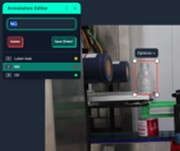<br>NG</td>
    <td align="center">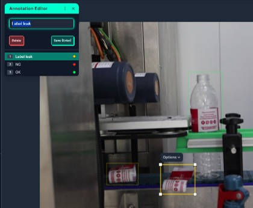<br>Label leak</td>
  </tr>
</table>

### 1.1 การทำความสะอาดและจัดระเบียบข้อมูล

ข้อมูลภาพที่ใช้จะมีหลากหลายรูปแบบ ได้แก่ ภาพแบบเต็มเฟรม ภาพ Crop เฉพาะขวด ภาพขวดน้ำแบบเต็มขวดที่ถ่ายจากมือถือเพิ่มเติม เมื่ออัปโหลดลงบนเว็บไซต์ Roboflow ทำการ Label และตรวจสอบการ label เรียบร้อยแล้ว จากข้อมูลภาพ 300 ภาพ ในขั้นตอน Train/Test/Split จะแบ่งข้อมูลออกเป็น 3 ส่วน ได้แก่ ชุดข้อมูลฝึกฝน (Train set) ชุดข้อมูลตรวจสอบ (Validation set) และชุดข้อมูลทดสอบ (Test set) เป็นสัดส่วน 70%, 20%, 10% ตามลำดับ

<p align="center">
  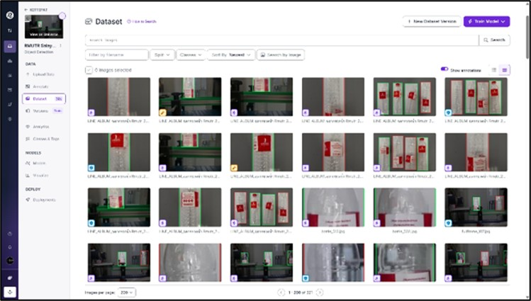
</p>

<p align="center">
  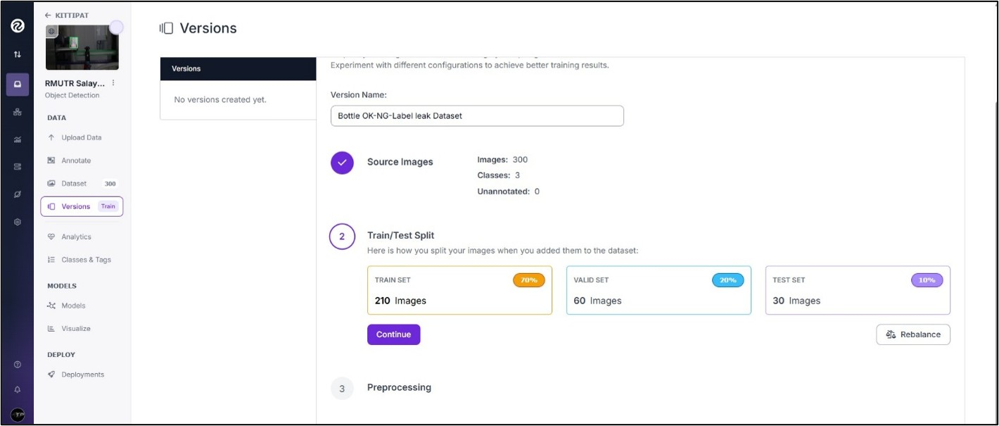
</p>

ในขั้นตอน Preprocessing เป็นการเตรียมข้อมูลภาพก่อนจะใช้การ Auto-Orient เพื่อยกเลิกการหมุนและกำหนดลำดับพิกเซลให้เป็นมาตรฐาน, Resize เพื่อลดขนาดภาพ Dataset ให้เป็น 640x640 พิกเซล เพื่อลดขนาดรูปภาพให้ไฟล์มีขนาดเล็กลงและ Train โมเดลได้เร็วขึ้น และ Auto-Adjust Contrast เพื่อเพิ่มความคมชัดตามฮิสโทแกรมของภาพและตรวจจับเส้นขอบในสภาพแสงที่แตกต่างกันได้ดีขึ้น

<p align="center">
  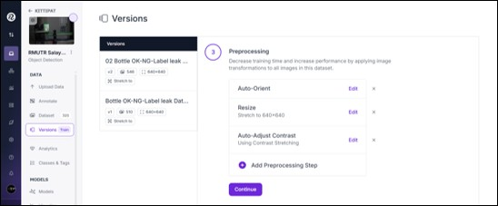
</p>

### 1.2 การเพิ่มข้อมูล (Data Augmentation)

Augmentation จะทำการแปลงภาพที่มีอยู่เพื่อสร้างรูปแบบใหม่และเพิ่มจำนวนภาพในชุดข้อมูล ซึ่งทำให้โมเดลมีความแม่นยำมากขึ้น ป้องกันการเกิด Overfitting เทคนิคที่จะใช้ช่วยเพิ่มข้อมูล ได้แก่ การพลิกภาพ (Flip), การหมุนภาพ (Rotation), การบิดภาพ (Shear), ความสว่าง (Brightness), ค่าการเปิดรับแสง (Exposure), การเบลอภาพ (Blur)

<p align="center">
  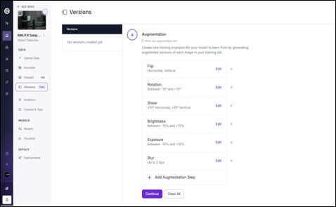
</p>

## 2. การทำงานของ Code (Code Operation)

### 2.1 สภาพแวดล้อมการทำงาน

แพลตฟอร์มที่ใช้ใน Mini Project นี้ได้แก่ PyCharm ใช้เขียนโปรแกรมทั้งหมดด้วยภาษา Python และติดตั้งไลบรารีที่จำเป็น, Roboflow ใช้ในการสร้างชุดข้อมูล (Dataset) และ Google Colab ใช้เฉพาะในการ Training Custom Model

ไลบรารีที่ติดตั้งและใช้งานใน PyCharm ได้แก่ OpenCV, YOLOv8, pandas, matplotlib ส่วน Dataset ใช้ผ่านเว็บไซต์ Roboflow และลิงก์ที่ระบุไว้ในขั้นตอน Training

<p align="center">
  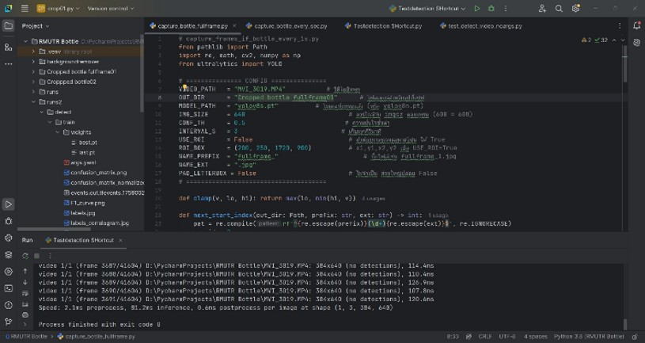<br>
  PyCharm
</p>

<p align="center">
  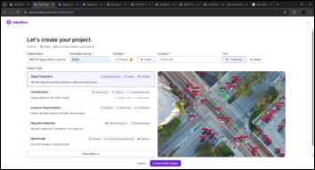<br>
  Roboflow
</p>

<p align="center">
  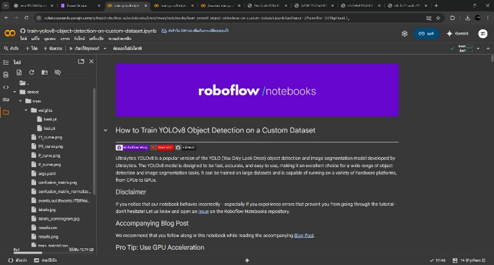<br>
  Google Colab
</p>

#### การติดตั้งไลบรารีใน PyCharm

โปรเจคนี้ติดตั้งไลบรารีใน Python interpreter หรือ Terminal ของ PyCharm โดยตรง และไม่ได้สร้างหรือใช้ virtual environment ภายใน repository ส่วน Google Colab ใช้เฉพาะสำหรับ Training Custom Model จึงไม่ต้องติดตั้งไลบรารีในเครื่องสำหรับ Colab ไฟล์ต้นฉบับไม่ได้ระบุ Python version แบบตายตัว แนะนำให้ใช้ **Python 3.11.x** เพื่อให้รองรับทั้งสคริปต์ตรวจจับและชุด `backgroundremover` ที่ยังเรียกใช้ `distutils` อยู่ โค้ดตรวจจับหลักอาจทำงานบน Python 3.12 ได้ แต่การใช้งาน `backgroundremover/cmd/cli.py` ควรใช้ Python 3.11 หรือต่ำกว่า หรือปรับโค้ดส่วนดังกล่าวก่อน

คำสั่งติดตั้งสำหรับ PyCharm Terminal บน Windows (รันจากโฟลเดอร์รากของ repository):

```powershell
cd ".\RMUTR Bottle"
python -m pip install --upgrade pip
```

ติดตั้งไลบรารีที่ใช้โดยสคริปต์ตรวจจับ การฝึกฝน และการวิเคราะห์ผลใน PyCharm:

```powershell
python -m pip install torch torchvision
python -m pip install ultralytics opencv-python numpy pandas matplotlib screeninfo
```

ถ้าต้องการใช้ชุดโค้ด `backgroundremover` ที่อยู่ใน repository ให้ติดตั้ง dependency เพิ่มเติม และติดตั้ง FFmpeg/`ffprobe` ให้เรียกได้จาก `PATH`:

```powershell
python -m pip install pillow scipy scikit-image pymatting moviepy ffmpeg-python requests flask waitress hsh
```

สำหรับการใช้ GPU ให้ติดตั้ง `torch` และ `torchvision` ให้ตรงกับเวอร์ชัน CUDA ของเครื่องตามตัวติดตั้ง PyTorch ที่ใช้งานจริง แล้วตรวจสอบด้วย:

```powershell
python -c "import torch; print(torch.__version__); print('CUDA:', torch.cuda.is_available())"
```

หมายเหตุ: repository นี้ยังไม่มี `requirements.txt` หรือ `pyproject.toml` และสคริปต์หลายไฟล์กำหนด path ของโมเดล/วิดีโอไว้ในตัวไฟล์ จึงต้องแก้ค่าบล็อก `CONFIG` ให้ตรงกับเครื่องก่อนรันทุกครั้ง ห้ามนำ Roboflow API key หรือ download code ที่มี token ขึ้น repository

#### ไฟล์โค้ด/สคริปต์ที่รันได้ในปัจจุบัน

จากการตรวจ repository ไม่พบไฟล์ Node.js (`.js` หรือ `.ts`) ดังนั้นรายการนี้จึงสรุปไฟล์โค้ด Python (`.py`) ที่มีอยู่และจุดเริ่มต้นที่เรียกใช้งานได้ในปัจจุบัน

ไฟล์ที่อยู่ในโฟลเดอร์ `RMUTR Bottle/` มีหน้าที่ดังนี้:

| ไฟล์ | หน้าที่และค่าเริ่มต้นสำคัญ |
|---|---|
| `capture_bottle_fullframe.py` | อ่าน `MVI_3019.MP4` ด้วย `yolov8s.pt`, ตรวจคลาส `bottle`, เก็บภาพเต็มเฟรมทุก 3 วินาทีลง `Cropped bottle fullframe01/` |
| `capture_bottle_every_sec.py` | อ่าน `MVI_3018.MP4`, ตรวจคลาส `bottle`, Crop ขวดพร้อม padding 8% ทุก 3 วินาทีลง `Cropped bottle03/` |
| `trainmodel GPU.py` | ตรวจ CUDA แล้วฝึก `yolov8m.pt` จาก `data.yaml` ด้วยค่าเริ่มต้น 50 epochs, `imgsz=240`, `batch=32` |
| `test_detect_video_noargs.py` | ทดสอบตรวจจับวิดีโอด้วยโมเดลจาก `runs2/detect/train/weights/best.pt`, แสดงผลแบบ real-time และเลือกบันทึกวิดีโอได้ |
| `test_roi_noargs.py` | ย่อวิดีโอแล้วตรวจจับเฉพาะ ROI ที่กำหนดใน `ROI_DISP` |
| `Testyolo_video_analytics.py` | ตรวจจับวิดีโอและสร้าง `annotated.mp4`, กราฟ 5 แบบ, CSV ต่อเฟรม และ `report.md` ใน `Testresult01/run_<timestamp>/` |
| `find point.py` | เล่นวิดีโอพร้อมแสดงพิกัดเมาส์ เหมาะสำหรับหาค่า ROI |
| `TestMonitorSize.py` | อ่านและแสดงความละเอียดจอภาพเครื่องแรก |
| `Testdetection SHortcut.py` | ตัวอย่างตรวจจับจาก webcam (`source=0`) ด้วยโมเดล path ที่กำหนดในไฟล์ |
| `test_swim01.py` | ตัวอย่างตรวจจับจาก webcam ด้วย `bestswim01.pt` ซึ่งไม่มีอยู่ใน repository ปัจจุบัน |
| `backgroundremover/cmd/cli.py` | จุดเริ่มต้น CLI สำหรับลบพื้นหลังภาพ/วิดีโอด้วย U2Net; เป็นโค้ดเสริม ไม่ใช่ pipeline ตรวจฉลากหลัก |
| `backgroundremover/cmd/server.py` | จุดเริ่มต้น Flask/Waitress server สำหรับลบพื้นหลัง โดยค่าเริ่มต้นใช้พอร์ต 5000 |
| `backgroundremover/` ที่เหลือ | โมดูลสนับสนุน U2Net, matting, การจัดการเฟรม และการดาวน์โหลดน้ำหนักโมเดล |

หมายเหตุ: path ค่าเริ่มต้นบางไฟล์เป็นชื่อจากการทดลองเดิม เช่น `runs2/`, `runs3 (1)/`, `MVI_3018.MP4` และ `MVI_3019.MP4` ซึ่งไม่มีไฟล์ตรงชื่อดังกล่าวใน repository ปัจจุบัน ให้แก้ `MODEL_PATH`, `VIDEO_PATH`, `OUTPUT_PATH` และ ROI ก่อนรัน

#### การรันสคริปต์

หลังจากเตรียมไฟล์ input และแก้ค่า config แล้ว ให้รันจากโฟลเดอร์ `RMUTR Bottle/`:

```powershell
# สร้างภาพเต็มเฟรมจากวิดีโอ
python capture_bottle_fullframe.py

# Crop เฉพาะขวดจากวิดีโอ
python capture_bottle_every_sec.py

# ฝึกโมเดลในเครื่อง (ต้องมี yolov8m.pt และ data.yaml)
python "trainmodel GPU.py"

# ตรวจจับวิดีโอแบบแสดงผล
python test_detect_video_noargs.py
python test_roi_noargs.py

# ตรวจจับพร้อมสร้างวิดีโอ กราฟ CSV และ report
python Testyolo_video_analytics.py

# เครื่องมือช่วยกำหนด ROI/ตรวจขนาดจอ
python "find point.py"
python TestMonitorSize.py

# ตัวอย่างตรวจจับจาก webcam
python "Testdetection SHortcut.py"
python test_swim01.py
```

เรียกใช้ชุด `backgroundremover` แบบ CLI หรือ server ได้ดังนี้:

```powershell
python -m backgroundremover.cmd.cli -i input.jpg -o output.png
python -m backgroundremover.cmd.server --port 5000
```

### 2.2 โครงสร้างและขั้นตอนการทำงานของโค้ด

ในส่วนของการฝึกฝนโมเดล (Training Model) จะใช้โมเดล YOLOv8s Object Detection : [Roboflow YOLOv8 notebook](https://colab.research.google.com/github/roboflow-ai/notebooks/blob/main/notebooks/train-yolov8-object-detection-on-custom-dataset.ipynb) มาฝึกฝนด้วย Dataset ของภาพขวดน้ำที่สร้างจาก Roboflow : [RMUTR Salaya Bottle Label Dataset](https://app.roboflow.com/kittipat-blwh5/rmutr-salaya-bottle-label-hybrid-ibceo/2) โดยจะใช้ T4 GPU บน Google Colab ที่มีประสิทธิภาพสูง Train โมเดลตามขั้นตอนต่อไปนี้

1. ข้อมูล GPU ตัวใดที่ได้รับการจัดสรรให้กับเซสชัน Colab ปัจจุบัน

   <p align="center">
     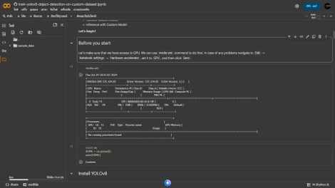
   </p>

2. ติดตั้ง library YOLOv8

   <p align="center">
     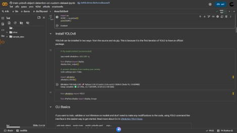
   </p>

3. Upload Dataset จาก Roboflow โดย copy download code ของ dataset มาวาง

   <p align="center">
     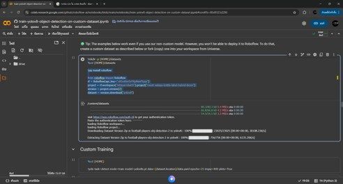
   </p>

4. กำหนดค่าพารามิเตอร์การ Train เป็น `yolov8s.pt`, `epochs=400` รอบ, `imgsz=640`

   <p align="center">
     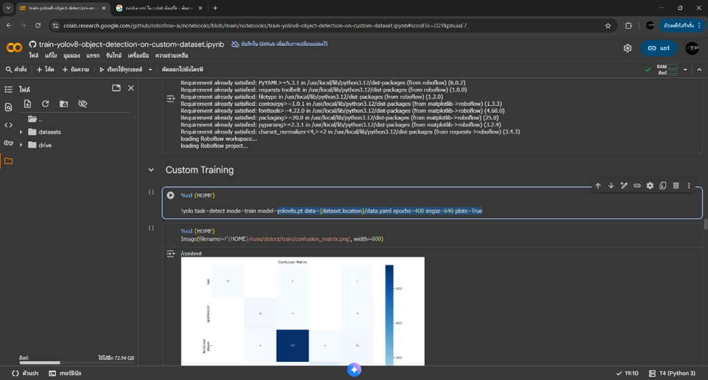
   </p>

5. เมื่อ Train เสร็จ ให้เพิ่ม shell แล้วใช้คำสั่ง `!zip -r /content/runs.zip /content/runs/` เพื่อบีบอัดโฟลเดอร์ผลลัพธ์ runs ให้เป็นไฟล์ `.zip` แล้วจึงจะสามารถ download ลงเครื่องคอมพิวเตอร์ได้

   <p align="center">
     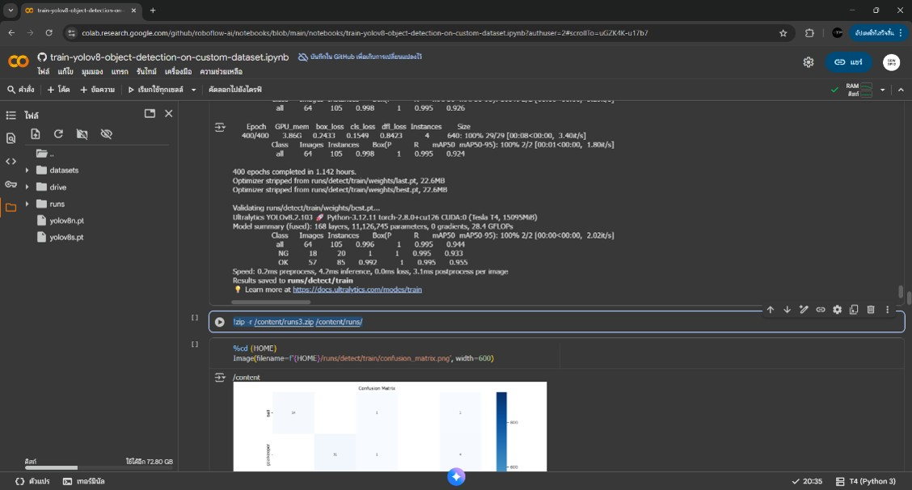
   </p>

โดยภาพรวมจะใช้ Machine Learning ให้โมเดลเรียนรู้ข้อมูลภาพ 3 Classes ดังนี้

6. Download ไฟล์ `runs.zip` ซึ่งจะมีข้อมูลผลลัพธ์จากการ Train ทั้งหมด เช่น Loss, mAP, precision, recall

   <p align="center">
     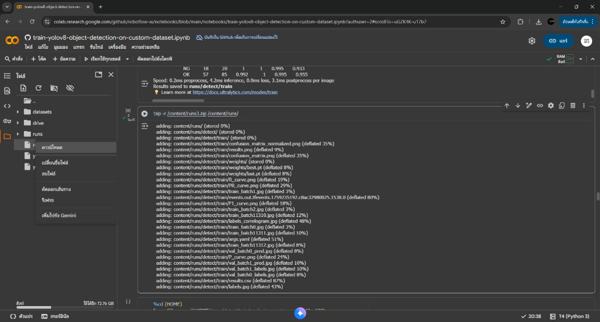
   </p>

## 3. การทดสอบและการประมวลผลของ Train Model (Train Model Accuracy)

### 3.1 ขั้นตอนการประมวลผล

1. โมเดลเดาว่าอะไร+อยู่ตรงไหน (Forward pass) ภาพผ่าน “backbone” (สกัดฟีเจอร์), ต่อด้วย “neck” รวมฟีเจอร์หลายสเกล และ “head” สำหรับการ Detection ผลลัพธ์ของ head คือ Bounding Box + Class ที่หลายตำแหน่ง หลายสเกล

2. จับคู่คำตอบโมเดลกับคำตอบจริง (Target assignment) โดยระบบจะจับคู่กล่องที่โมเดลเดากับ ground truth ในภาพนั้น ๆ แล้วคำนวณความต่าง (error) ระหว่างค่าที่เดากับค่าจริง แล้ววัดความผิดพลาดด้วยฟังก์ชัน Loss ซึ่ง YOLOv8 สรุปความผิดพลาดหลัก ๆ เป็น 3 ส่วน

   - box_loss: ความคลาดเคลื่อนตำแหน่ง/ขนาดกล่อง (ใช้ IoU-based + DFL ช่วยให้บอกตำแหน่งละเอียดขึ้น)
   - cls_loss: ความผิดพลาดในการทาย Class
   - dfl_loss: (Distribution Focal Loss) ตัวช่วยให้การระบุตำแหน่งกล่องคมและนิ่งขึ้น

3. ปรับค่า Weight ของโมเดล (Backpropagation + Optimizer) โดยจะคำนวณ gradient จาก loss แล้วไหลย้อนกลับไปปรับ weights ทุกชั้นของโมเดล มีการใช้ตัวช่วยอย่าง AdamW/SGD และ learning rate เพื่อค่อย ๆ ลด loss

4. ตรวจสอบด้วยชุด Validation ทุก epoch โดยหลังจบแต่ละ epoch จะลองรันกับ validation set ที่โมเดลไม่เห็นตอนปรับน้ำหนักเพื่อวัดคุณภาพโมเดลจริง เช่น precision, recall, mAP@50, mAP@50-95 ,กราฟ PR/F1, confusion matrix

5. ระบบจะเซฟ best.pt (โมเดลที่ทำคะแนนจาก validation set ที่ดีที่สุด) และ last.pt (โมเดลที่ปรับล่าสุด)

<p align="center">
  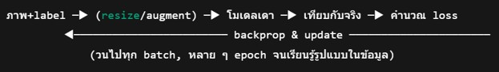
</p>

### 3.2 ผลลัพธ์จากการฝึกฝน

<p align="center">
  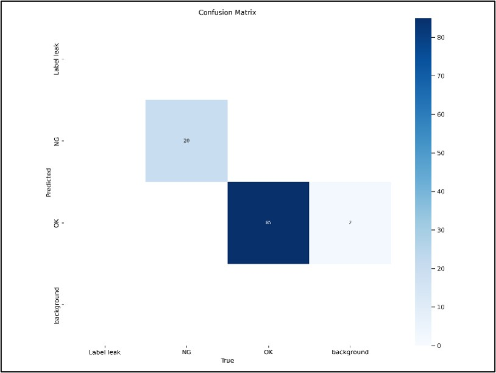
</p>

<table align="center">
  <tr>
    <td>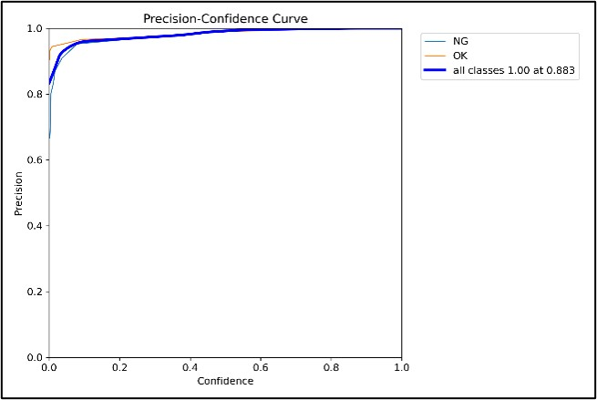</td>
    <td>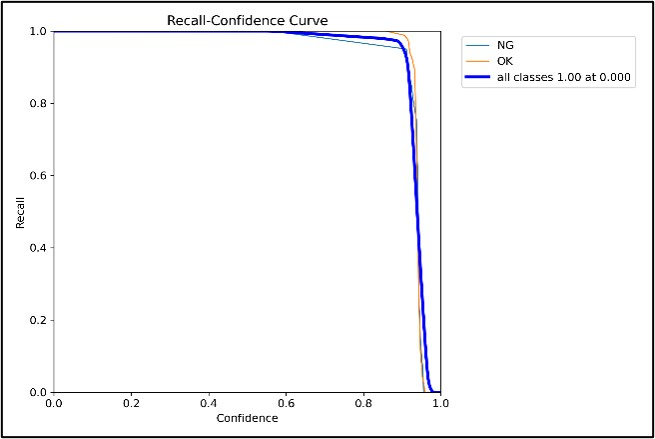</td>
  </tr>
</table>

<p align="center">
  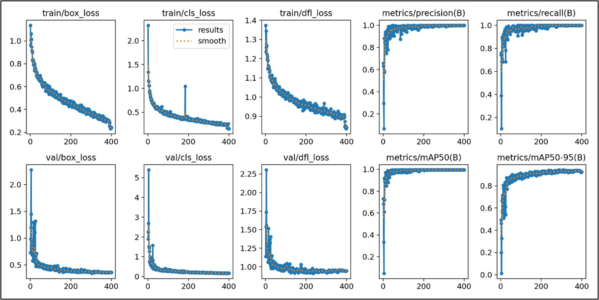
</p>

## 4. ความแม่นยำของ Test Model (Test Model Accuracy)

การใช้โมเดลที่ฝึกฝนแล้วทำนายผล (Predict) จากภาพใหม่ที่โมเดลไม่เคยเรียนรู้มาก่อนบน Google Colab สามารถรันได้บน Shell : Inference with Custom Model

<p align="center">
  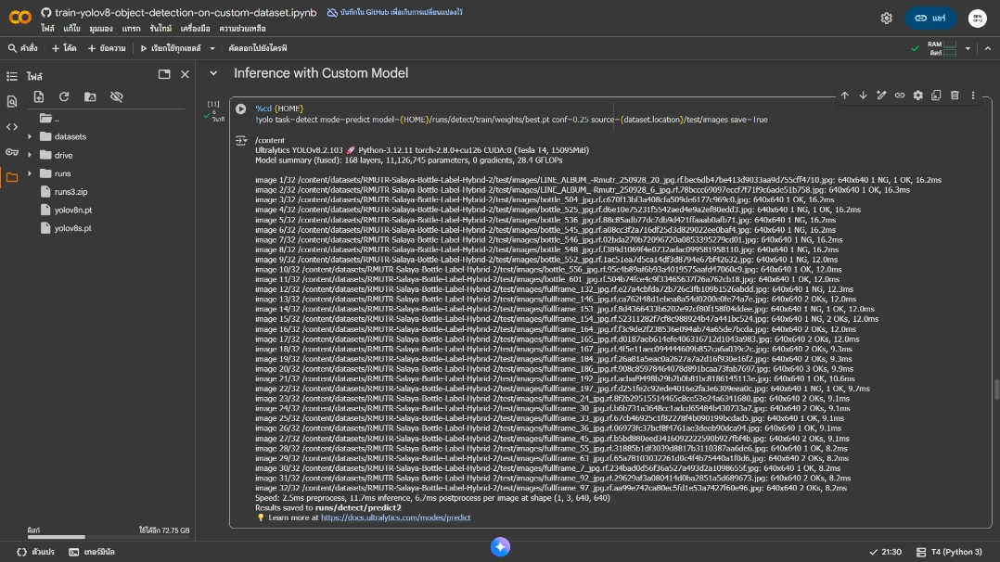
</p>

<p align="center">
  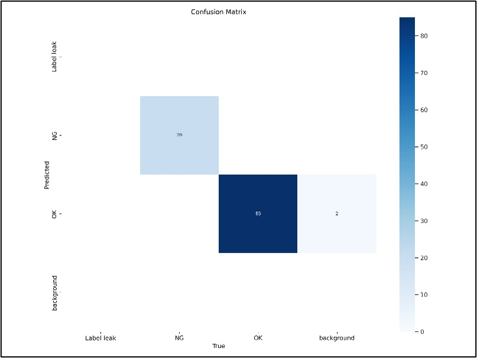
</p>

<table align="center">
  <tr>
    <td></td>
    <td></td>
  </tr>
</table>

## 5. บทสรุปและข้อเสนอแนะ

<table align="center">
  <tr>
    <td>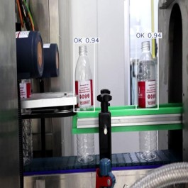</td>
    <td>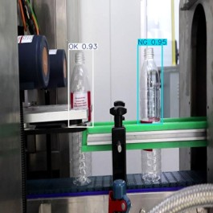</td>
  </tr>
  <tr>
    <td>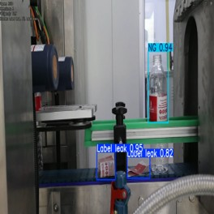</td>
    <td>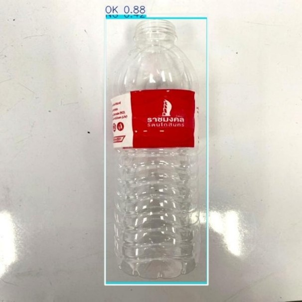</td>
  </tr>
</table>

จาก Mini Project นี้ สรุปได้ว่า โมเดลสามารถตรวจจับขวดน้ำที่ฉลากอยู่ในตำแหน่งต่าง ๆ จากข้อมูลที่ไม่เคยเห็นได้ค่อนข้างแม่นยำมาก เนื่องจากมีการใช้ข้อมูลภาพใน Dataset ค่อนข้างมากและ Train epoch มากพอที่จะปรับให้ค่า Loss ต่ำสุดและคงที่ ในอนาคตอาจจะปรับปรุงโมเดลเพิ่มเติม เช่น เพิ่มข้อมูลที่ถ่ายจากหลากหลายมุม หลากหลายพื้นหลัง หลากหลายแสงมากขึ้น หรืออาจจะใช้โมเดลที่ใหญ่และซับซ้อนขึ้น

วิดีโอ Inference/ผลการทำนาย: [ดูคลิป Inference](https://youtu.be/NY6tvybFny8) ลิงก์นี้เป็นคลิปผลการทำนายของโมเดล ไม่ใช่คลิปวิดีโอดิบจากโรงงาน (ลิงก์ต้นฉบับอยู่ใน [`assets/Inferring_video_link`](assets/Inferring_video_link))

   <p align="center">
     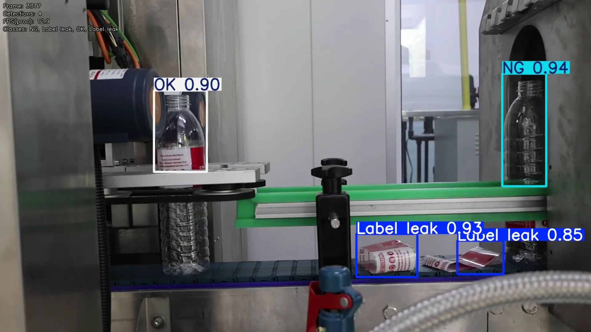
   </p>

## คณะผู้จัดทำ

1. นายปภังกร อุบลหล้า รหัสนักศึกษา 1651010441135 สาขาวิชาวิศวกรรมเมคคาทรอนิกส์
2. นายปรัชญา กุลพิศาล รหัสนักศึกษา 1651010441137 สาขาวิชาวิศวกรรมเมคคาทรอนิกส์
3. นางสาวกัญชรส โตลักษณะ รหัสนักศึกษา 1651010441144 สาขาวิชาวิศวกรรมเมคคาทรอนิกส์
4. นายกิตติพัฒน์ เถื่อนวงษ์ รหัสนักศึกษา 1651010441148 สาขาวิชาวิศวกรรมเมคคาทรอนิกส์

## เอกสารประกอบใน Repository

- [เอกสารฉบับ DOCX](<RMUTR Bottle/docs/โมเดลตรวจสอบฉลากขวดน้ำ RMUTR.docx>)
- [เอกสารฉบับ PDF](<RMUTR Bottle/docs/โมเดลตรวจสอบฉลากขวดน้ำ RMUTR บู ปรัช ม่อน เฟิร์น.pdf>)
